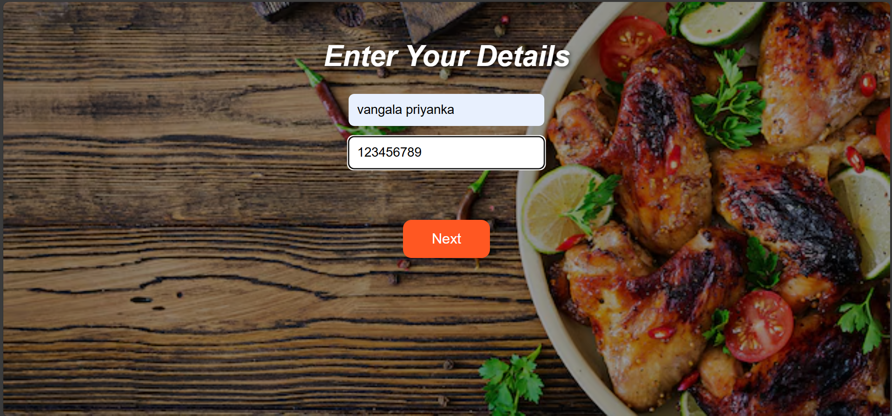
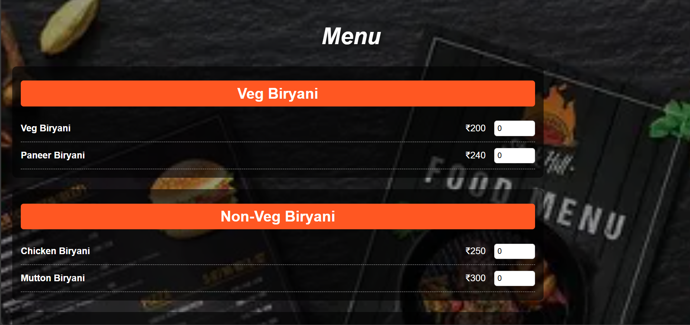
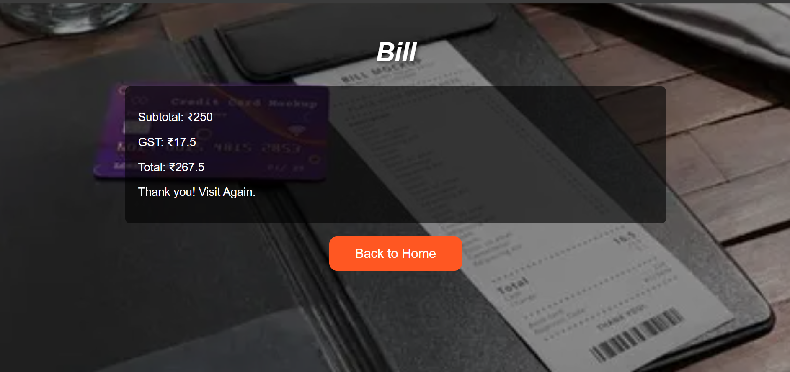

# Restaurant Ordering System 🍽️

A full-stack web application that simulates a restaurant ordering system. Customers can enter their details, browse the menu, place orders, and get an automatically generated bill. The project uses **Flask** (Python) for the backend, **MySQL** for the database, and **HTML/CSS/JS** for the frontend with background images for a realistic UI.

## Features

- Home page with **restaurant name** and **Order Now** button
- Login page for customer details (name & phone)
- Menu page with categorized items (Veg, Non-Veg, Starters, Ice Creams)
- Quantity selection for each menu item
- Automatic calculation of **Subtotal, GST, and Total**
- Bill page showing order summary
- Responsive and visually appealing UI with background images
- MySQL backend to store orders and customer data

---

## Technologies Used

- **Backend:** Python, Flask  
- **Frontend:** HTML, CSS, JavaScript  
- **Database:** MySQL  
- **Others:** Git, GitHub  

---

## Screenshots

**Home Page**  


**Login Page**  


**Menu Page**  


**Bill Page**  


> Make sure to upload screenshots to a folder named `screenshots` in the repository.

---

## Setup Instructions

1. **Clone the repository:**

```bash
git clone https://github.com/Priya-2189/restaurant-ordering-system.git
cd restaurant-ordering-system
````

2. **Create a virtual environment (optional but recommended):**

```bash
python -m venv venv
venv\Scripts\activate      # Windows
source venv/bin/activate   # Linux/Mac
```

3. **Install dependencies:**

```bash
pip install -r requirements.txt
```

4. **Set up the database:**

* Create a MySQL database named `restaurant_app`.
* Import the schema from `database/schema.sql`:

```sql
mysql -u username -p restaurant_app < database/schema.sql
```

* Update `app.py` with your MySQL username and password.

5. **Run the Flask app:**

```bash
python app.py
```

* Open your browser at `http://127.0.0.1:5000`.

---

## Database

* **Database Name:** restaurant_app
* **Tables:**

  * `customers` → Stores customer information
  * `orders` → Stores orders with items, quantity, and price
* **Schema File:** `database/schema.sql`

---

## Usage

1. Open the Home Page and click **Order Now**.
2. Enter customer details on the Login Page.
3. Browse the Menu Page and select quantities for items.
4. Click **Next** to place the order.
5. View the Bill Page with subtotal, GST, and total amount.
6. Go back to Home to start a new order.

---

## Folder Structure


restaurant-ordering-system/
│
├── app.py              # Main Flask application
├── requirements.txt    # Python dependencies
├── templates/          # HTML files
├── static/
│   ├── css/            # CSS files
│   ├── js/             # JS files
│   └── images/         # Background & menu images
├── database/
│   └── schema.sql      # MySQL database schema
├── screenshots/        # Screenshot images
└── README.md


## Author

**Vangala Priyanka Priya**
[GitHub](https://github.com/Priya-2189)


